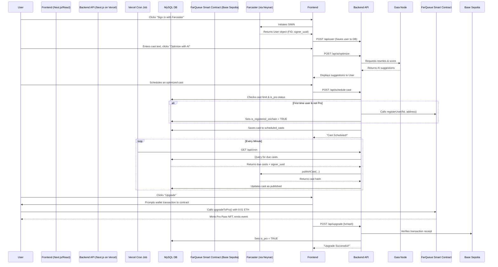

# FarQueue: Your Smart Farcaster Scheduler


**FarQueue is a powerful, on-chain integrated application that brings the much-needed feature of cast scheduling to the Farcaster ecosystem. It's not just a scheduler; it's a smart content assistant, using AI to help users write more engaging casts and publishing them at the perfect time.**

**Live Demo:** [https://youtu.be/sLNBUD6ffqk](https://youtu.be/sLNBUD6ffqk)

#### Screenshots


----------

## The Problem

Farcaster is a vibrant, real-time social protocol. However, creators, brands, and busy individuals lack the tools to schedule their content in advance, forcing them to post manually. This limits content strategy, global audience engagement, and overall efficiency. Furthermore, crafting the "perfect" cast that resonates with the audience is more of an art than a science.

## Our Solution: FarQueue

FarQueue solves these problems by providing a seamless, intelligent, and transparent platform to:

-   **Schedule & Automate:** Write casts now and have them published at any time in the future, powered by reliable Vercel Cron Jobs.
    
-   **Optimize with AI:** Supercharge your content with our AI-powered "Rewrite" and "Engagement Scoring" features, built on Gaia Nodes.
    
-   **Verify On-Chain:** Every key user action, from joining to upgrading, is recorded on the Base Sepolia blockchain for ultimate transparency.
    
-   **Upgrade Seamlessly:** A simple, one-click upgrade path for power users, handled by a secure, on-chain payment flow.
    

## Key Features

-   **Smart Scheduling & Automation:** A robust scheduling system built on Vercel Cron Jobs ensures your casts are published reliably and on time.
    
-   **AI-Powered Content Studio:**
    
    -   **AI Rewrite:** Get three alternative versions of your cast—more engaging, more concise, or a question—to maximize impact.
        
    -   **Engagement Scoring:** Receive an instant score (1-100) and justification for your cast's potential performance.
        
-   **Verifiable On-Chain Identity:**
    -   **Pro Pass NFT:** Pro users receive a FarQueue Pro Pass (ERC-721) NFT as a verifiable, on-chain proof of their premium status.
    -   **User Registration Event:** Every user's first scheduled cast is recorded via a UserRegistered event on our smart contract.
        
-   **Personalized User Dashboard:** A dedicated space for users to view their membership status, upgrade transaction, and full history of queued and published casts.
    
-   **Seamless Farcaster Integration:** Secure sign-in and cast publishing powered by the Neynar SDK.
    
-   **Tiered Access Model:** A generous free tier (15 casts/month) with a simple, on-chain upgrade path to a "Pro" unlimited plan.
    

----------

## How It Works: Architecture Overview

FarQueue is a full-stack Next.js application that intelligently combines a serverless frontend, on-demand API routes, scheduled functions, and on-chain smart contracts.




----------

## On-Chain Integration: The FarQueueRegistry Contract

*  **Contract Address (Base Sepolia):**  `0xBe036159a4114A434b2b1F9e6915d310EC471274`
*  **Block Explorer URL:**  `https://base-sepolia.blockscout.com/address/0xBe036159a4114A434b2b1F9e6915d310EC471274`

#### Smart Contract Code

```
// SPDX-License-Identifier: MIT
pragma solidity ^0.8.20;

import "@openzeppelin/contracts@4.9.5/token/ERC721/ERC721.sol";
import "@openzeppelin/contracts@4.9.5/access/Ownable.sol";
import "@openzeppelin/contracts@4.9.5/security/Pausable.sol";
import "@openzeppelin/contracts@4.9.5/security/ReentrancyGuard.sol";
import "@openzeppelin/contracts@4.9.5/utils/Strings.sol";

contract MySecureNFT is ERC721, Ownable, Pausable, ReentrancyGuard {
    using Strings for uint256;
    uint256 private _tokenIdCounter;
    string private _baseTokenURI;
    bool private _mintingAllowed;
    event TokenMinted(address indexed minter, uint256 tokenId);
    
    constructor(string memory name, string memory symbol, string memory baseTokenURI)
        ERC721(name, symbol)
    {
        _baseTokenURI = baseTokenURI;
        _mintingAllowed = true;
    }
    
    // Modifiers
    modifier onlyWhenMintingAllowed() {
        require(_mintingAllowed, "Minting is disabled");
        _;
    }
    
    // External Functions
    function pauseMinting() external onlyOwner {
        _mintingAllowed = false;
    }
    
    function resumeMinting() external onlyOwner {
        _mintingAllowed = true;
    }
    
    function setBaseURI(string memory newBaseURI) external onlyOwner {
        _baseTokenURI = newBaseURI;
    }
    
    function safeMint(address to) external payable onlyWhenMintingAllowed nonReentrant whenNotPaused {
        _tokenIdCounter++;
        uint256 tokenId = _tokenIdCounter;
        _safeMint(to, tokenId);
        emit TokenMinted(msg.sender, tokenId);
    }
    
    // Overrides
    function tokenURI(uint256 tokenId) public view override returns (string memory) {
        require(_exists(tokenId), "Token does not exist");
        return bytes(_baseTokenURI).length > 0
            ? string(abi.encodePacked(_baseTokenURI, tokenId.toString()))
            : "";
    }
    
    function _baseURI() internal view virtual override returns (string memory) {
        return _baseTokenURI;
    }
    
    // Pausable Overrides
    function pause() public onlyOwner {
        _pause();
    }
    function unpause() public onlyOwner {
        _unpause();
    }
}
```
----------

## Tech Stack

-   **Frontend:** Next.js, React, TypeScript, wagmi
    
-   **Backend:** Next.js API Routes, Vercel Serverless & Cron Jobs
    
-   **Farcaster Integration:** Neynar SDK (@neynar/react, @neynar/nodejs-sdk)
    
-   **Database:** MySQL
    
-   **AI:** Gaia Nodes (via OpenAI SDK)
    
-   **Blockchain:** Solidity, OpenZeppelin, Base Sepolia
    
-   **Deployment:** Vercel
    

----------

## Getting Started & Running Locally

#### Installation

1.  **Clone the repository:**
	```bash
	git clone https://github.com/harishkotra/FarQueue
	cd FarQueue
	```
2.  **Install dependencies:** 
	```bash
	npm install
	```
    
3.  **Set up the database:** Connect to MySQL and run the SQL schema provided in the previous steps.
    
4.  **Configure Environment Variables:** Create a .env.local file and fill in all the required credentials.
Create a `.env.local` file in the project root and fill in your credentials:

```

# From dev.neynar.com
NEYNAR_API_KEY="YOUR_NEYNAR_API_KEY"
NEXT_PUBLIC_NEYNAR_CLIENT_ID="YOUR_NEYNAR_CLIENT_ID"
# Your MySQL Database Credentials
DB_HOST="YOUR_DATABASE_HOST"
DB_USER="YOUR_DATABASE_USER"
DB_PASSWORD="YOUR_DATABASE_PASSWORD"
DB_NAME="YOUR_DATABASE_NAME"

# Your backend wallet that will pay gas fees on Base Sepolia
BACKEND_WALLET_PRIVATE_KEY="0xYourPrivateKey"

# The address where you deployed the FarQueueRegistry contract
NEXT_PUBLIC_CONTRACT_ADDRESS="YourContractAddress"

# Your wallet address to receive x402 payments
RECEIVING_WALLET_ADDRESS="YourReceivingWalletAddress"

NEXT_PUBLIC_APP_URL="http://localhost:3000"

GAIA_NODE_URL="https://qwen72b.gaia.domains/v1"
GAIA_API_KEY="GAIA_API_KEY"
GAIA_MODEL_NAME="Qwen3-30B-A3B-Q5_K_M"

CRON_SECRET="your generated secret"
```

#### **Run the application:**

*  **Start the web server:**
	```bash
	npm run dev
	```
*  **Start the cron job (in a separate terminal):**

	```bash
	npm run cron:run
	```

Open [http://localhost:3000](http://localhost:3000) to view the application.

---
    

----------

## Future Vision & Next Steps

FarQueue is more than a hackathon project; it's the foundation for a comprehensive content intelligence platform on Farcaster.

#### Phase 1: Private Beta & Waitlist (Post-Hackathon)

Our immediate goal is to refine the product based on real-world feedback.

-   **Onboard Waitlist Users:** We will launch a waitlist to begin onboarding an initial cohort of creators and power users in a controlled, rolling basis.
    
-   **Core Feature Polish:** Based on feedback, we will implement the most requested quality-of-life features:
    
    -   **Edit & Delete:** Allow users to manage their queue before casts are published.
        
    -   **Recurring Casts:** Schedule casts to repeat daily, weekly, or monthly.
        

#### Phase 2: The AI Content Strategist

We will expand our AI capabilities to move from optimization to strategic planning.

-   **AI Scheduling Assistant:** Instead of picking a time, users can use natural language: "Post this when my followers are most active," or "Drop this during peak weekend engagement." Our AI will analyze user and network data to find the optimal time.
    
-   **Content Strategy Suggestions:** The AI will analyze a user's most successful casts and suggest new topics, formats, or channels that align with their audience.
    

#### Long-Term Vision: The Automation Layer for Farcaster

-   **Team Accounts:** Enable shared queues and collaborative scheduling for brands, DAOs, and creator teams.
    
-   **Automated Engagement:** Allow users to set up rules for auto-replying to mentions or recasting high-engagement content within their niche.
    
-   **Multi-Protocol Support:** Expand FarQueue's capabilities to other decentralized social protocols, becoming the go-to content automation tool for the open social web.

### Progress Screenshots for Base Batches 002

v1.0


v0.1


