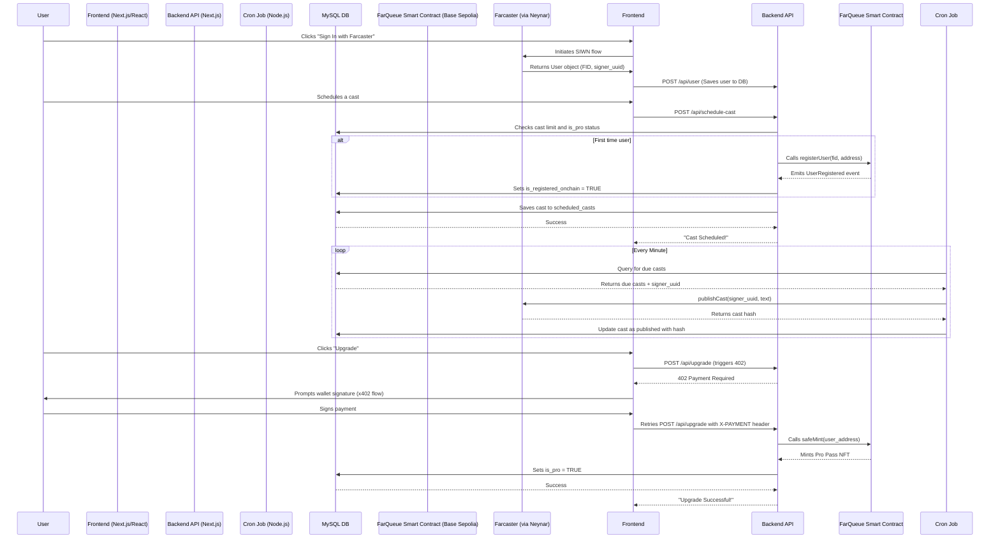

# FarQueue: Your Smart Farcaster Scheduler

**FarQueue is a powerful, on-chain integrated application that brings the much-needed feature of cast scheduling to the Farcaster ecosystem. Built with a robust backend, a clean user interface, and seamless web3 integration, FarQueue empowers users to plan their content, engage their audience, and manage their presence on Farcaster more effectively.**

**Live Demo:**  TBD

---

## The Problem

Farcaster is a vibrant, real-time social protocol. However, creators, brands, and busy individuals lack the tools to schedule their content in advance, forcing them to post manually at specific times. This limits content strategy, global audience engagement, and overall efficiency.

## Our Solution

FarQueue solves this by providing a simple and intuitive platform to:
*   **Sign in seamlessly** with your Farcaster account.
*   **Schedule casts** to be published at any time in the future.
*   **Manage a content queue** with a clear view of pending and published casts.
*   **Offer a tiered system** with a generous free tier and an on-chain upgrade path for power users.

## Key Features

*   **Secure Farcaster Authentication:** Utilizes Sign In with Neynar (SIWN) for secure, wallet-based login.
*   **Intuitive Cast Scheduling:** A simple UI with a text editor and a datetime picker to schedule casts.
*   **Automated Publishing:** A reliable backend cron job that uses the Neynar SDK to publish scheduled casts at the exact specified time.
*   **Tiered Access Model:**
    *   **Free Tier:** All users can schedule up to 15 casts per month.
    *   **Pro Tier:** Unlimited casting for a one-time payment of 0.01 ETH on Base Sepolia.
*   **On-Chain Integration (Base Sepolia):**
    *   **Pro Pass NFT:** Pro users receive a "FarQueue Pro Pass" NFT (ERC-721) as a verifiable, on-chain proof of their status.
    *   **On-Chain Activity for All:** Every user's first scheduled cast is recorded on-chain via a `UserRegistered` event, making all user engagement with the platform transparent and verifiable.
*   **x402 Payment Protocol:** A seamless, one-click upgrade experience using the x402 standard for on-chain payments.

---

## How It Works: Architecture Overview

FarQueue is a full-stack Next.js application that intelligently combines off-chain and on-chain components to deliver a seamless user experience.



---

## On-Chain Integration: The `FarQueueRegistry` Contract

To ensure transparency and user ownership, all key user milestones are recorded on the Base Sepolia blockchain via our `FarQueueRegistry` smart contract.

*   **Contract Address (Base Sepolia):** `0x10CCdCB5f2b031d3840425499750Bf6013F26c54`
*   **Block Explorer URL:** `https://base-sepolia.blockscout.com/tx/0x08fef233c2ae6a705bc4439f897a2612742d6fe8a8a7e408181239057ae719d2`

#### On-Chain Actions:

1.  **Free User Registration:** When a new user schedules their first cast, our backend calls the `registerUser` function. This is a gas-efficient method that emits a `UserRegistered(fid, walletAddress)` event, creating an immutable, public record of their onboarding.
2.  **Pro Membership NFT:** When a user successfully pays to upgrade, our backend calls the `safeMint` function, minting a non-transferable "FarQueue Pro Pass" (FQP) NFT directly to their wallet. This token acts as a permanent, on-chain proof of their pro status.

#### Smart Contract Code

```solidity
// contracts/FarQueueRegistry.sol
// SPDX-License-Identifier: MIT
pragma solidity ^0.8.20;

import "@openzeppelin/contracts/token/ERC721/ERC721.sol";
import "@openzeppelin/contracts/access/Ownable.sol";
import "@openzeppelin/contracts/utils/Counters.sol";

contract FarQueueRegistry is ERC721, Ownable {
    using Counters for Counters.Counter;
    Counters.Counter private _tokenIdCounter;

    event UserRegistered(uint256 indexed fid, address indexed walletAddress);

    constructor() ERC721("FarQueue Pro Pass", "FQP") Ownable(msg.sender) {}

    /**
     * @dev Mints a Pro Pass NFT to a user who has paid. Only the contract owner can call this.
     * @param to The wallet address of the user to receive the NFT.
     */
    function safeMint(address to) public onlyOwner {
        _tokenIdCounter.increment();
        uint256 tokenId = _tokenIdCounter.current();
        _safeMint(to, tokenId);
    }

    /**
     * @dev Records a free user's first on-chain interaction by emitting an event.
     * @param fid The Farcaster ID of the user.
     * @param userAddress The wallet address associated with the user.
     */
    function registerUser(uint256 fid, address userAddress) public onlyOwner {
        emit UserRegistered(fid, userAddress);
    }
}
```

---

## Tech Stack

*   **Frontend:** Next.js, React, TypeScript, wagmi
*   **Backend:** Next.js API Routes, Node.js
*   **Farcaster Integration:** Neynar SDK (`@neynar/react`, `@neynar/nodejs-sdk`)
*   **Database:** MySQL
*   **Payments:** x402 Protocol (`x402-next`)
*   **Blockchain:** Solidity, OpenZeppelin, Base Sepolia
*   **Scheduling:** `node-cron`

---

## Getting Started & Running Locally

Follow these instructions to get a local copy up and running for development and testing.

#### Prerequisites

*   Node.js (v18 or later)
*   npm or yarn
*   A running MySQL database instance

#### Installation

1.  **Clone the repository:**
    ```bash
    git clone https://github.com/harishkotra/FarQueue
    cd farqueue
    ```

2.  **Install dependencies:**
    ```bash
    npm install
    ```

3.  **Set up the database:**
    Connect to your MySQL instance and run the following SQL commands to create the necessary tables:
    ```sql
    -- Table to store Farcaster user information
    CREATE TABLE users (
        fid BIGINT PRIMARY KEY,
        signer_uuid VARCHAR(255) NOT NULL UNIQUE,
        username VARCHAR(255),
        display_name VARCHAR(255),
        pfp_url VARCHAR(255),
        created_at TIMESTAMP DEFAULT CURRENT_TIMESTAMP,
        is_pro BOOLEAN NOT NULL DEFAULT FALSE,
        is_registered_onchain BOOLEAN NOT NULL DEFAULT FALSE,
        verified_address VARCHAR(255) NULL
    );

    -- Table to store scheduled casts
    CREATE TABLE scheduled_casts (
        id INT AUTO_INCREMENT PRIMARY KEY,
        user_fid BIGINT NOT NULL,
        cast_text TEXT NOT NULL,
        publish_at TIMESTAMP NOT NULL,
        is_published BOOLEAN DEFAULT FALSE,
        published_hash VARCHAR(255) NULL,
        created_at TIMESTAMP DEFAULT CURRENT_TIMESTAMP,
        updated_at TIMESTAMP DEFAULT CURRENT_TIMESTAMP ON UPDATE CURRENT_TIMESTAMP,
        FOREIGN KEY (user_fid) REFERENCES users(fid)
    );

    -- Add an index for querying due casts efficiently
    CREATE INDEX idx_publish_at_is_published ON scheduled_casts (publish_at, is_published);
    ```

4.  **Configure Environment Variables:**
    Create a `.env.local` file in the project root and fill in your credentials:
    ```
    # From dev.neynar.com
    NEYNAR_API_KEY="YOUR_NEYNAR_API_KEY"
    NEXT_PUBLIC_NEYNAR_CLIENT_ID="YOUR_NEYNAR_CLIENT_ID"

    # Your MySQL Database Credentials
    DB_HOST="YOUR_DATABASE_HOST"
    DB_USER="YOUR_DATABASE_USER"
    DB_PASSWORD="YOUR_DATABASE_PASSWORD"
    DB_NAME="YOUR_DATABASE_NAME"

    # Your backend wallet that will pay gas fees on Base Sepolia
    BACKEND_WALLET_PRIVATE_KEY="0xYourPrivateKey"

    # The address where you deployed the FarQueueRegistry contract
    NEXT_PUBLIC_CONTRACT_ADDRESS="YourContractAddress"
    
    # Your wallet address to receive x402 payments
    RECEIVING_WALLET_ADDRESS="YourReceivingWalletAddress"
    ```

5.  **Run the application:**
    *   **Start the web server:**
        ```bash
        npm run dev
        ```
    *   **Start the cron job (in a separate terminal):**
        ```bash
        npm run cron:run
        ```

    Open [http://localhost:3000](http://localhost:3000) to view the application.

---

## Future Vision & Next Steps

FarQueue aims to become the premier automation and content intelligence layer for the Farcaster protocol. We're moving beyond simple scheduling to provide a comprehensive suite of tools that help creators maximize their impact.

#### Immediate Next Steps (Post-Hackathon)

Our short-term roadmap is focused on enhancing the core user experience and integrating our first set of AI-powered features.

1.  **AI-Powered Cast Optimization:**
    *   **AI Rewrite:** Before scheduling, users will have an option to "Optimize with AI." Our backend will use a large language model to rewrite their cast for improved clarity, engagement, and impact, offering several alternatives.
    *   **Engagement Scoring:** The AI will provide an estimated "Engagement Score" for the user's cast, giving them feedback on its potential performance.

2.  **Queue Management:**
    *   **Edit & Delete:** Allow users to modify or remove casts from their queue before they are published.
    *   **Recurring Casts:** Implement a feature to schedule casts that repeat on a daily, weekly, or monthly basis, perfect for regular announcements or series.

3.  **User Dashboard & Analytics:**
    *   A dedicated page for users to view analytics on their published casts (likes, recasts, replies). This data will be crucial for the AI's future learning.

#### Long-Term Vision

Our long-term goal is to build a fully autonomous content strategist for Farcaster users.

*   **AI-Powered Scheduling Assistant:**
    *   Instead of just picking a time, users can give natural language commands like, "Post this when my followers in Asia are most active," or "Publish this during peak weekend engagement."
    *   The AI will analyze the user's historical engagement data, their followers' activity patterns, and broader network trends to determine the absolute optimal time to publish a cast for maximum reach and interaction.

*   **Advanced Content Tools:**
    *   **Thread Scheduling:** Allow users to compose and schedule entire multi-cast threads. The AI will help structure the thread for narrative impact.
    *   **Content Strategy Suggestions:** Based on a user's successful posts, the AI will suggest new topics, formats, or channels they should engage with.

*   **Team & Collaborative Features:**
    *   Enable shared queues and scheduling permissions for brands, DAOs, and creator teams.


### Progress Screenshots for Base Batches 002

v1.0


v0.1


